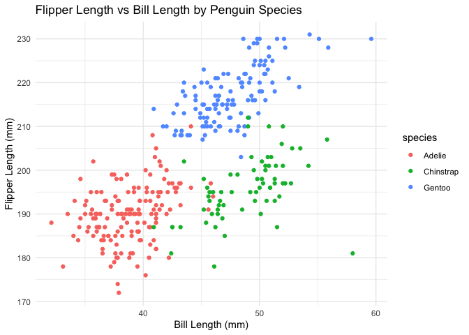

p8105_hw1_hc3448
================
2024-09-16

## Problem 1

``` r
data("penguins", package = "palmerpenguins")
```

The `penguins` dataset contains 344 rows and 8 columns. It provides
information on penguin species (value: Adelie, Gentoo, Chinstrap), on
islands (value: Torgersen, Biscoe, Dream), and with other important
variables such as `sex`, `year`, `bill_depth_mm`, `flipper_length_mm`,
and `body_mass_g`. The mean flipper length of the penguins is
200.9152047 mm.

``` r
library(ggplot2)
ggplot(data = penguins, aes(x = bill_length_mm, y = flipper_length_mm, color = species)) +
  geom_point() +
  labs(title = "Flipper Length vs Bill Length by Penguin Species",
       x = "Bill Length (mm)",
       y = "Flipper Length (mm)") +
  theme_minimal()
```

<!-- -->

``` r
ggsave("penguin_scatterplot.png", width = 8, height = 6)
```

## Problem 2

``` r
library(tidyverse)
```

``` r
set.seed(1)

df <- tibble(
  numeric_var = rnorm(10),  #a random sample of size 10 from a standard Normal distribution             
  logical_var = rnorm(10) > 0, #a logical vector indicating whether elements of the sample are greater than 0   
  char_var = letters[1:10],   #a character vector of length 10
  factor_var = factor(rep(c("A", "B", "C"), length.out = 10))  #a factor vector of length 10, with 3 different factor “levels”
)

# Extract columns using pull() and calculate means
mean_numeric <- df %>% pull(numeric_var) %>% mean()
mean_logical <- df %>% pull(logical_var) %>% mean()
mean_char <- df %>% pull(char_var) %>%  mean()
```

    ## Warning in mean.default(.): argument is not numeric or logical: returning NA

``` r
mean_factor <- df %>% pull(factor_var) %>%  mean()
```

    ## Warning in mean.default(.): argument is not numeric or logical: returning NA

``` r
list(mean_numeric = mean_numeric,
     mean_logical = mean_logical,
     mean_char = mean_char,
     mean_factor = mean_factor)
```

    ## $mean_numeric
    ## [1] 0.1322028
    ## 
    ## $mean_logical
    ## [1] 0.6
    ## 
    ## $mean_char
    ## [1] NA
    ## 
    ## $mean_factor
    ## [1] NA

The mean calculation of the random sample of size 10 from a standard
Normal distribution works directly as it is a numeric vector.  
The mean calculation of the logical vector works because true is treated
as 1 and false as 0. The mean will be the proportion of true values in
the logical vector.  
The mean calculation of the character vector doesn’t work.  
The mean of the factor vector doesn’t work because it represents
categorical data and not numercial values.

``` r
mean_logical <- df %>% pull(logical_var) %>% as.numeric() %>% mean()
mean_char <- df %>% pull(char_var) %>% as.numeric() %>% mean()
mean_factor <- df %>% pull(factor_var) %>% as.numeric() %>% mean()

list(mean_logical = mean_logical,
     mean_char = mean_char,
     mean_factor = mean_factor)
```

Logical: TRUE becomes 1 and FALSE becomes 0, so you get a numeric vector
with these values.  
Character: Characters are not directly convertible to numeric. It will
return NA with a warning unless the characters are valid numeric
strings.  
Factor: The underlying integer codes of the factor levels are converted
to numeric. If the factor levels are A, B, C, the conversion will yield
the integers corresponding to these levels.

Yes. When we attempt to take the mean of a character or factor variable
without converting them to numeric first, we get an error because the
mean function expects numeric input. Converting factors and characters
to numeric makes sense because it allows you to compute a mean based on
their underlying numeric representation.
